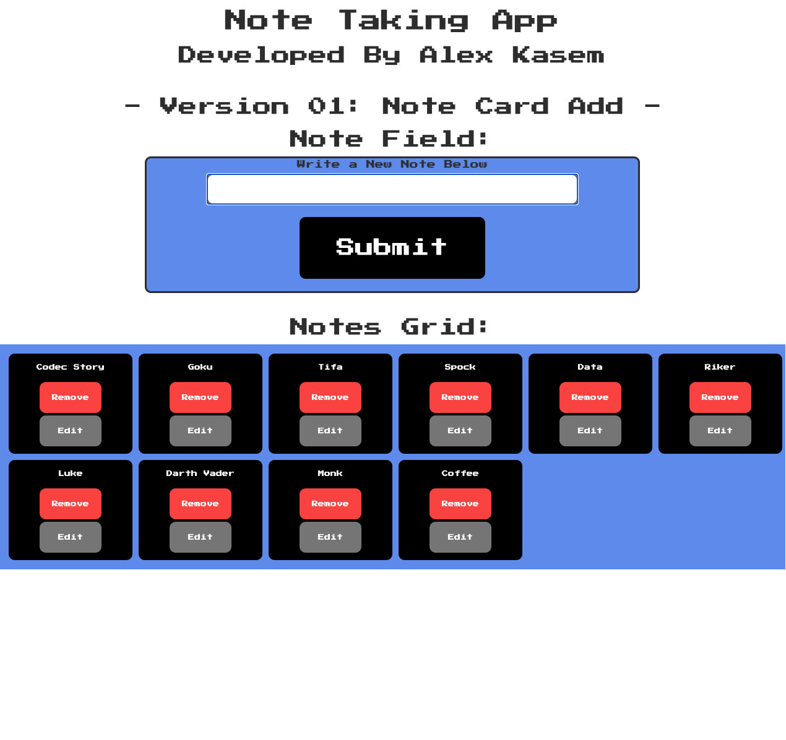

# Note Assessment App

## Trello Board Link: https://trello.com/b/WR7rc9CH/playbook-technical-challenge

## GitHub Repo: https://github.com/ak89mkii/note-card-app

## Notes:
### Directions:
- Write note in field.
- Press submit button.
  - Notes appear from left to right (up to 6 across).
- Delete Button: Deletes specific note.
- Edit Button: Opens prompt window for new note.
- Select note card (empty space on either side of buttons) to highlight card. Select another card to have the cards switch positions.

### Streach Goals:
 Switch removes highlight.
- a child element bug fix (text area can currently switch with parent element.)